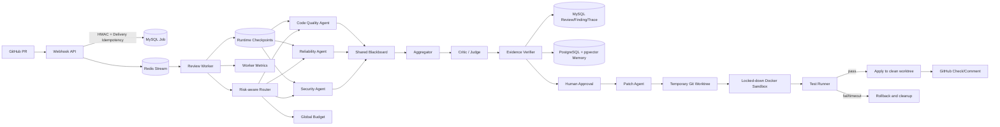

# PRGuard 架构说明

## 关键设计取舍

- Redis Streams 通过 Consumer Group、Pending、XAUTOCLAIM、Heartbeat、重试和 Dead Letter 形成可靠消费链路。
- Review 和 Worker 分离，模型调用不阻塞 HTTP 请求线程。
- Router 根据 Diff 风险信号动态选择专家；所有专家共享模型调用、Token、时长和并发预算。
- 多 Agent 结果进入版本化 Blackboard，经过去重聚合、Critic/Judge 冲突仲裁和证据验收。
- 每个 Specialist 使用独立 checkpoint key；相同 Diff、模型、Pipeline 和长期记忆输入下，恢复时复用已完成输出，只重跑失败部分。
- 通用 Agent Runtime 将计划 DAG、工作记忆、消息快照、Pending Action 和工具执行账本共同持久化，恢复语义见 [Agent Runtime 与断点恢复](./AGENT_RUNTIME_RECOVERY.md)。
- 修复验证在临时 Git worktree 中执行，测试通过后才写入用户工作区。
- Worktree 负责文件回滚，Docker Sandbox 负责禁网、凭证隔离和 CPU/内存/PID 等进程资源限制；生产模式失败关闭。
- GitHub 写操作默认关闭，开启后使用独立 Token，失败只记录 Trace。

## 进程边界

| 进程 | 职责 | 入口 |
|---|---|---|
| API | Webhook、Review Job、Admin、Trace 查询 | `8787` |
| Worker | Redis 消费、Agent Review、GitHub 反馈 | Redis Streams |
| Worker Metrics | Worker 进程指标 | `9091` |
| MySQL | 业务结果和审计持久化 | `3306` |
| PostgreSQL | Episodic/Semantic/Procedural/Feedback 长期记忆与向量检索 | `5432` |
| Redis | 异步任务和 Pending 状态 | `6380 -> 6379` |
