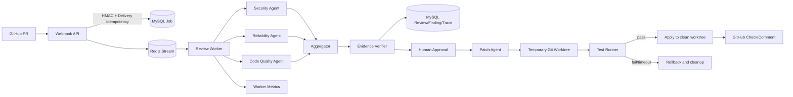

# PRGuard 架构说明

## 关键设计取舍

- Redis Streams 通过 Consumer Group、Pending、XAUTOCLAIM、Heartbeat、重试和 Dead Letter 形成可靠消费链路。
- Review 和 Worker 分离，模型调用不阻塞 HTTP 请求线程。
- 多 Agent 负责不同风险视角，Finding 必须经过聚合和证据验收。
- 修复验证在临时 Git worktree 中执行，测试通过后才写入用户工作区。
- GitHub 写操作默认关闭，开启后使用独立 Token，失败只记录 Trace。

## 进程边界

| 进程 | 职责 | 入口 |
|---|---|---|
| API | Webhook、Review Job、Admin、Trace 查询 | `8787` |
| Worker | Redis 消费、Agent Review、GitHub 反馈 | Redis Streams |
| Worker Metrics | Worker 进程指标 | `9091` |
| MySQL | 业务结果和审计持久化 | `3306` |
| Redis | 异步任务和 Pending 状态 | `6380 -> 6379` |
